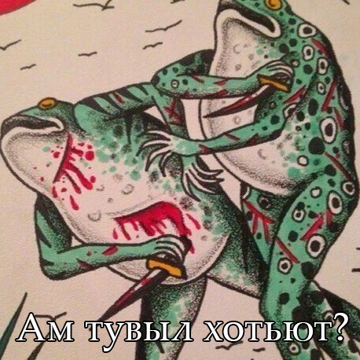

<h1 align="center">Mansi Memes</h1>

**Read in:** [English](https://github.com/avysmorfias/mansi-memes/blob/main/README.md) | [Esperanto](https://github.com/avysmorfias/mansi-memes/blob/main/README.eo.md)

**Mansi Memes** — это проект по созданию мемов на мансийском языке, одном из исчезающих языков коренных народов Сибири.

## Зачем?

Мемы — это простой и живой способ передавать мысли и эмоции. С помощью смешных картинок я хочу поддержать интерес к языку и культуре, которым грозит исчезновение.

## Как это работает?

Я изучаю сканы старых словарей, учебников, записываю слова в свой личный словарик, а затем, используя понравившиеся мне шаблоны, создаю мемы, которые сопровождаю переводом на английский, русский и эсперанто!

### Эсперанто?...

> Я перевожу мемы на английский, русский и эсперанто, чтобы их могли понять как носители русского, так и те, кто интересуется лингвистикой и исчезающими языками. Эсперанто — мой способ сделать проект доступным миру.

### Словари и учебники, которые у меня есть:

- **Краткий мансийско-русский словарь** — `Чернецов, Чернецова` 1936 (4000 слов)
- **Мансийско-русский словарь** — `Баландин, Вархушев` 1958
- **Словарь мансийско-русский и русско-мансийский** — `Ромбандеева, Кузакова` 1982 (4000 слов)
- **Букварь на мансийском (вогульском) языке** — `Черенцова` 1983
- **Мансийско-русский словарь** (Кондинский диалект) — `Кузакова` 2001
- **Русско-мансийский словарь** — `Ромбандеев` 2005 (11 000 слов)
- **Практический курс мансийского языка. Часть 2** - `Скрибник` 2007
- **Мансийско-русский словарь** (верхне лозвиньский диалект) — `Бахтиярова, Динисламов` 2016 (2000 слов)
- **Краткий мансийско-русский словарь** (для учащихся 1-4 классов) — `Кумаев` 2019 (800 слов)
- **Картинный фразеологический словарь мансийского языка** — `Динисламова` 2020
- **Словарь топонимов мансийского языка** — `Слинкина` 2024

*У вас есть другие книги по мансийскому языку? Отправьте их мне: beeressence@gmail.com!*

## Галерея

  

"Me and who?" / "Я и кто?" / "Mi kaj kiu?"

  

"Why" / "Почему" / "Kial"

## Структура данных

Каждый мем описывается в формате [JSON](https://github.com/avysmorfias/mansi-memes/memes.json) и включает:
- название файла
- диалект
-  уровень языка
- тему
- перевод на английский, русский и эсперанто

## Как можно помочь?

Если ты:
- интересуешься исчезающими языками;
- изучаешь мансийский;
- или просто хочешь поддержать необычный культурный проект

То ты можешь помочь проекту:
- Поставь звездочку ⭐
- Предложи идею в [issue](https://github.com/avysmorfias/mansi-memes/issues)
- Помоги с переводом
- Предложи свой любимый шаблон мема
- Изучай мансийский вместе со мной!

## Об авторских правах

**Изображения**  
Большинство мемов использует популярные интернет-шаблоны, авторство которых может быть неизвестно.  
Если вы — автор изображения и хотите удалить или изменить публикацию, пожалуйста, напишите мне.

**Тексты и переводы**  
Все надписи и переводы в мемах принадлежат [Avysmorfias](https://github.com/avysmorfias)  
и распространяются по лицензии [CC BY-NC-SA 4.0](https://creativecommons.org/licenses/by-nc-sa/4.0/).
